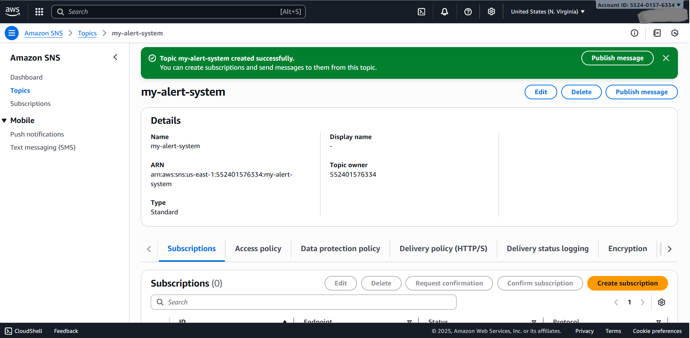

# My First AWS Notification System 📧

## Project Description

This project demonstrates the creation of a simple alert system using Amazon's Simple Notification Service (SNS). The goal was to create a messaging "topic," subscribe an email address to it, and then publish a notification that gets delivered to my inbox. This project showcases the principles of pub/sub (publish/subscribe) messaging in the cloud.

## 🚀 Steps I Followed

1.  **Navigated to SNS:** Logged into the AWS Management Console and went to the Simple Notification Service dashboard.

2.  **Created an SNS Topic:** Created a new "Standard" SNS topic named `my-alert-system`. This acts as the central channel for all notifications.
    

3.  **Created and Confirmed a Subscription:** Created a subscription to the topic using the "Email" protocol. I then checked my email inbox for the confirmation link from AWS and clicked it to activate the subscription. The status then changed from "Pending" to "Confirmed."
    

4.  **Published a Message & Verified Delivery:** Published a test message to the topic. I then checked my email and confirmed that I received the notification successfully. This proved the entire system was working end-to-end.
    

5.  **Cleaned Up Resources:** To avoid any charges, I deleted the subscription and then deleted the SNS topic itself, leaving the account clean.

## 🧠 What I Learned

* The fundamental concept of a pub/sub messaging model.
* How to create and configure an SNS Topic, which acts as a single point for message distribution.
* How to create and confirm a subscription for an endpoint.
* The importance of resource cleanup in AWS to manage costs effectively.

## 🛠️ Tools Used

* AWS Management Console
* Amazon Simple Notification Service (SNS)

## Project Status

**Status:** Successfully implemented and then destroyed to avoid costs.
